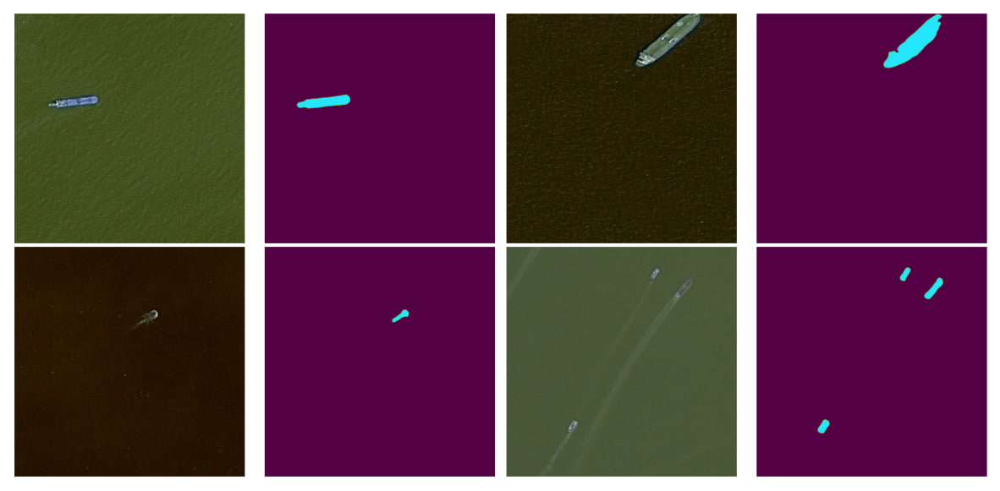

# AirbusSegmentation

Airbus Ship Detection Challenge from Kaggle

## Overview 

This project showcases my solution to the [Airbus Ship Detection Challenge](https://www.kaggle.com/competitions/airbus-ship-detection), where the task was to segment ship images. In the sections below, you will find details on the data preprocessing techniques, the chosen model, parameters, and more.



## Description

1. **Dataset:** I refined the dataset based on [this](https://www.kaggle.com/competitions/airbus-ship-detection/discussion/71667) discussion. To address data leakage, I trained the model exclusively on images with ships, utilizing the approach outlined in [this](https://www.kaggle.com/code/manuscrits/create-a-validation-dataset-correcting-the-leak/notebook) public kernel. The corresponding code is available in `create_clear_dataset.ipynb`.

2. **Model:** I employed a Unet with a ResNet34 encoder, pretrained on IMAGENET1K. While I experimented with ResNext50, the ResNet34 model yielded better results. Training was conducted on 512x512 images. Although I tried various cropping techniques to produce 256x256 images, the initial variant delivered superior results with the same number of epochs.

3. **Parameters:**
   * For augmentation, I drew inspiration from [this](https://www.kaggle.com/competitions/airbus-ship-detection/discussion/71659) kernel. The applied augmentations include horizontal and vertical flips, RandomBrightnessContrast, rotation by 90 degrees, and GaussianBlur for denoising the image.
    * For the loss function, I used the sum of BCELoss and DiceLoss. The relevant code can be found in `loss.py`.
   * During training, I utilized the Adam optimizer with an initial learning rate of 3e-4. The MultiStepLR scheduler was employed with milestones set at [3, 6], and corresponding learning rate values of [1e-4, 7e-5]. Additionally, the ReduceLROnPlateau scheduler with a factor of 0.7 was used. Validation was performed on full-sized 768x768 images. Also, I've chosen a threshold of 0.6 for mask encoding. This threshold minimizes false positive predictions while maintaining a satisfactory true positive rate.

4. **Results:** After 7 epochs, the performance metrics are as follows:
   * F1-score: 0.84 on train, 0.78 on validation
   * F2-score: 0.84 on train, 0.77 on validation
   * Intersection over Union (IoU): 0.72 on train, 0.65 on validation

## Usage

### **Instructions for Using This Project:**
>**Note:** Before utilizing this model, please download the [dataset](https://www.kaggle.com/c/airbus-ship-detection/data) and organize it within the project's `data` folder. The structure should resemble the following:
>
> ├── data
> │   ├── test_v2
> │   ├── train_v2
> │   ├── sample_submission_v2.csv
> │   └── train_ship_segmentations_v2.csv

1. First clone the repository. To do this, open a terminal, go to the directory where you want to clone the project and then enter the command:
```bash
git clone https://github.com/Strongich/AirbusSegmentation.git
```
2. Go to folder with project and install virtualenv, write the following command and press Enter:
```bash
pip install virtualenv
```
3. Next create a new environment, write the following command and press Enter:
```bash
virtualenv name_of_the_new_env
```
#### Example:
```bash
virtualenv airbus
```
4. Next activate the new environment, write the following command and press Enter:
```bash
name_of_the_new_env\Scripts\activate
```
#### Example:
```bash
airbus\Scripts\activate
```
5. Write the following command and press Enter:
 ```bash
pip install -r requirements.txt
```
6. To launch the training process, execute the following command and press Enter:
```bash
cd src
python train.py --image_height 512 --image_width 512 --images_path "../data/train_v2" --masks_path "../data_cleared/uniqueAllLabels.csv" --lr 3e-4 --epochs 10 --batch_size_train 16 --batch_size_val 8
```
Feel free to modify the parameters according to your available resources and requirements.
7. To launch the inference, execute the following command and press Enter:
```bash
cd src
python inference.py
```
After the inference process is complete, you will find the output file at `runs/output.csv`.


## Conclusion

In this project, we have developed an Unet architecture model to segment the ships. Using parameters above we have achieved f2-score 0.77 on validation after 7 epochs.

## Author

This AirbusSegmentation was created by Vitenko Igor. If you have any questions or require further assistance, feel free to contact igor.vitenko13@gmail.com.
